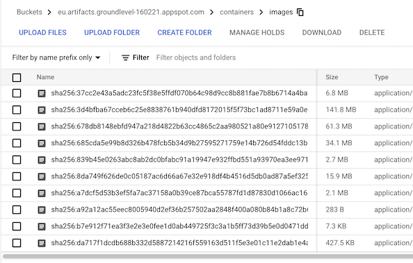

# firebase-custom-builder

Docker image for projects needing to run Firebase CLI, `npm` and Firebase emulation (which requires Java).

**Provides**

- `firebase-tools` & emulators (*)
  - OpenJDK 11
- node.js 14 (LTS)
- `npm` 6.x

(*) These emulators are pre-fetched: `database`, `firestore`, `pubsub`.

The image is based on [BusyBox](https://en.wikipedia.org/wiki/BusyBox). 

We add some command line comfort:

||version|
|---|---|
|`bash`|v.5.0.11+|
|`curl`|7.67.0+|

Naturally, you may add more by deriving the Dockerfile or just forking it.

**Other images**

There are [many images](https://hub.docker.com/search?q=firebase&type=image) for Firebase in Docker Hub but they seem to be made for personal use, and don't e.g. track tooling upgrades. They may also sport some project specific libraries which makes them unsuitable as a base image. The idea is to gather that momentum together so if you have your own, please consider using this instead for a stronger Firebase testing community.

- Community [Firebase image](https://github.com/GoogleCloudPlatform/cloud-builders-community/tree/master/firebase)

  Is left behind. 
  
  The info that there's emulation (that requires Java) has not reached it, yet. There is an [issue](https://github.com/GoogleCloudPlatform/cloud-builders-community/issues/441) raised but no PR. Pushing this code to the community repo would be the right thing to do but feels like too much friction for the author.

- [`timbru31/docker-java-node`](https://github.com/timbru31/docker-java-node)
 
  This repo is mentioned as a foundation having both Java and Node. However, the author faced problems building it (23-Mar-21). Being based on "Azul" OpenJDK image wasn't reaffirming for general use, either. 

  The repo takes a JDK/JRE base image and installs Node on top of it. This repo does the opposite: takes a Node base image and installs Java on top of that.


---

Publishing Docker images may be costly (you are charged by the downloads, and images are big), so the approach taken here is that you build the image on your own, and push it to a private repo that *your* projects use.

This certainly works for the author.


## Requirements

- Docker
- Gnu `make`
- `gcloud` CLI

Recommended (optional):

- [dive](https://github.com/wagoodman/dive) - "A tool for exploring each layer in a docker image"

### Configure Docker

>Before you can push or pull images, you must configure Docker to use the gcloud command-line tool to authenticate requests to Container Registry.<sub>[source](https://cloud.google.com/container-registry/docs/quickstart)</sub>

```
$ gcloud auth configure-docker
```

## Build the image locally

You can do this simply to see that the build succeeds.

```
$ make build
...
Successfully built 29a6e8655e16
```

It should result in an image of ~706 <!--was:~679--> MB in size, containing:

- JDK
- `firebase` CLI
- `node`, `npm` and `yarn`
- Emulator images in `.cache/firebase/emulators/`

You can check the size by:

```
$ docker image ls firebase-custom-builder:9.6.0-node14
REPOSITORY                TAG                 IMAGE ID            CREATED             SIZE
firebase-custom-builder   9.6.0-node14        c196e6e1881e        2 minutes ago       706MB
```


## Push to...

### Container Registry (Google Cloud)

Check that there is a suitable GCP project:

```
$ gcloud config get-value project 2>/dev/null
some-230321
```

Decide, which domain you wish to push the image to.

This should ideally be close to where your builds happen. See GCR > [Pushing and pulling](https://cloud.google.com/container-registry/docs/pushing-and-pulling).

Prefix the command then with `_GCR_IO=[asia|eu|us].gcr.io`, according to your needs.

*tbd. We could also interactively ask this. One day..*

```
$ _GCR_IO=eu.gcr.io make push
docker build --build-arg FIREBASE_VERSION=9.6.0 . -t firebase-custom-builder:9.6.0-node14
...
Successfully built 6e84ee9f7a74
Successfully tagged firebase-custom-builder:9.6.0-node14
docker tag firebase-custom-builder:9.6.0-node14 gcr.io/groundlevel-160221/firebase-custom-builder:9.6.0-node14
docker push gcr.io/groundlevel-160221/firebase-custom-builder:9.6.0-node14
The push refers to repository [gcr.io/groundlevel-160221/firebase-custom-builder]
7d5805f5a13c: Pushed 
493987b335c5: Pushed 
09bb4df3245b: Pushed 
a9f0fd5d0c5e: Pushed 
aedafbecb0b3: Layer already exists 
db809908a198: Layer already exists 
1b235e8e7bda: Layer already exists 
3e207b409db3: Layer already exists 
9.6.0-node14: digest: sha256:97f17c562507799c6b52786147d70aa56c848ee2d67eff590aa567d7a9b1c019 size: 2003
```

### Pushing `latest`

The above instructions (and the `Makefile`) only push a *tagged* image. 

If you want, you can also push one with tag `latest`. This allows your users to get a default version.

```
$ PROJECT_ID=..fill in..
$ docker tag firebase-custom-builder:9.6.0-node14 eu.gcr.io/$PROJECT_ID/firebase-custom-builder:latest
$ docker push eu.gcr.io/$PROJECT_ID/firebase-custom-builder:latest
The push refers to repository [eu.gcr.io/groundlevel-160221/firebase-custom-builder]
8962ccd62f6e: Layer already exists 
e53a3c030bdb: Layer already exists 
b05570e678df: Layer already exists 
1952ae150c4a: Layer already exists 
aedafbecb0b3: Layer already exists 
db809908a198: Layer already exists 
1b235e8e7bda: Layer already exists 
3e207b409db3: Layer already exists 
latest: digest: sha256:8344e59785e1a74eaf00708fdb8522bb098beec7f440f407abcfc601d2e4d6b4 size: 2003
```

### Managing the images (= costs 💵💶!)

The data you push to the cloud is kept at Cloud Registry and creates costs simply by taking space. It's good to understand what's pushed, where, with what parameters and have a cleanup strategy.

>

Your images end up crowding the bucket:

GCP Console > Storage > `eu.artifacts.<project-id>.appspot.com` > `containers` > `images`

The screenshot is after the bucket was cleared (`DELETE`) and *one* image was pushed. Your image layers likely each occupy a single file, here.

<!-- not relevant?
#### Save the Penny 

The bucket is created automatically, as a "multiregion" bucket (those cost more than single-region ones). If this is overkill for you (as a hobbyist), here are things you can do:

- [change Container Registry to use a single region](...)

   TL;DR Remove the bucket. Recreate with single region.
-->

#### Container Registry Pricing

See -> [Container Registry pricing](https://cloud.google.com/container-registry/pricing)

>The price for Standard buckets in a multi-region is about $0.026 per GB per month.

i.e. for keeping a single 557MB image, it's ~0,01 € / month.

Cloud Build (in wait of regional builders) runs in the U.S. and *each build* pulls in the image, anew, from say EU. This falls into the "*Data moves between different continents and neither is Australia.*" bucket ;) of pricing.

For this, [general network usage](https://cloud.google.com/storage/pricing#network-egress) is applied. Since we are in the EU, no free tier (5GB) (it only applies to certain US regions).

$0.12 / GB

This means - if the author understood the pricing right - that *each build* you run with Cloud Build (in the US) costs ~0.10 EUR.

Is this much?

50 builds for 5 eur.

Now consider that each PR means a build - or multiple, depending on what you change. Each change to a PR also means a build - or multiple. When you merge the PR, one or two more builds. These add up.

It's still limited by the source of the CI/CD events being humans, but something like 1000 builds per month might not be out of question. That would be 100 eur or so.

#### Counter-acting

The obvious way is to avoid the over-the-ocean shipment of data. This could be done in three ways:

- Push everything to the US (since the builds happen there)

   This is a sensible strategy. It's just that the author wants to do things "right" (environmental concerns and so forth) and keep things local. Transmissions do raise CO2 emissions.

	>Note that the CO2 argument doesn't really hold here. Shipping the *sources* is about 500kB (for the author's project) and pushing a new builder image happens rarely. The output size - again - is smallish, so deploying from the US to EU would not be costly. So my earlier point is moot, and it's just about pride. :D

- Caching of the images, on the US side

   It seems unnecessary that Cloud Build re-fetches the whole builder image, again and again, for each build. If I can easily set up a caching of eg. "keep builder images for 6 hours", that likely reduces the ocean crossings (and costs) by 5..10x.

- Regional builds

   Such have been asked for, for a few years.
   
   The author would welcome this option.

Note that this decision has nothing to do with GDPR, because we are not handling customer data, only building of the tools that will (which will again run in the EU).


## Using the image

You can now use the image eg. in Cloud Build as:

```
eu.gcr.io/$PROJECT_ID/firebase-custom-builder:9.6.0-node14
```

If you pushed the `latest` tag, you can leave out the tag at the end:

```
eu.gcr.io/$PROJECT_ID/firebase-custom-builder
```

>Note: You can leave `$PROJECT_ID` in the `cloudbuild.yaml`. Cloud Build knows to replace it with the current GCP project.

---

>**❗️IMPORTANT NOTE:**
>
>Emulator images are left in the `/root/.cache` folder. In order for you to benefit from them (so that running emulators won't refetch the packages, for each build), you must do this step before running the emulators.
>
>```
>- name: eu.gcr.io/$PROJECT_ID/firebase-custom-builder
  entrypoint: bash
  args: ['-c', 'mv /root/.cache ~/.cache']
>```
>Cloud Build replaces the home directory with `/builder/home` and *does not keep* existing contents in such a folder. This is not good manners; we'd rather it would respect the image's premade Home.

---


## References

- `nodejs/docker-node` > [Node.js > How to use this image](https://github.com/nodejs/docker-node/blob/master/README.md#how-to-use-this-image) (node docs)
- Cloud Build > ... > [Creating a custom builder](https://cloud.google.com/build/docs/configuring-builds/use-community-and-custom-builders#creating_a_custom_builder) (Cloud Build docs)

